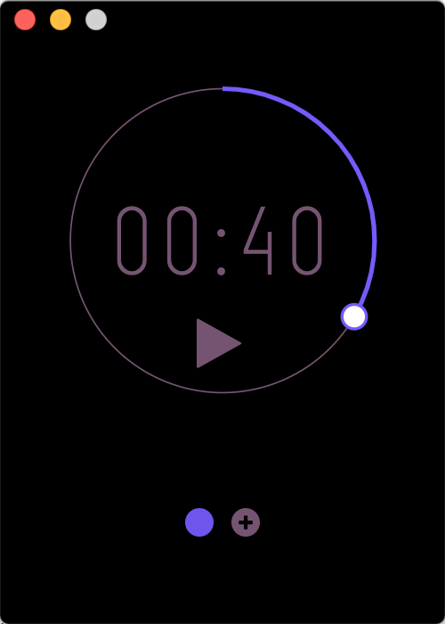
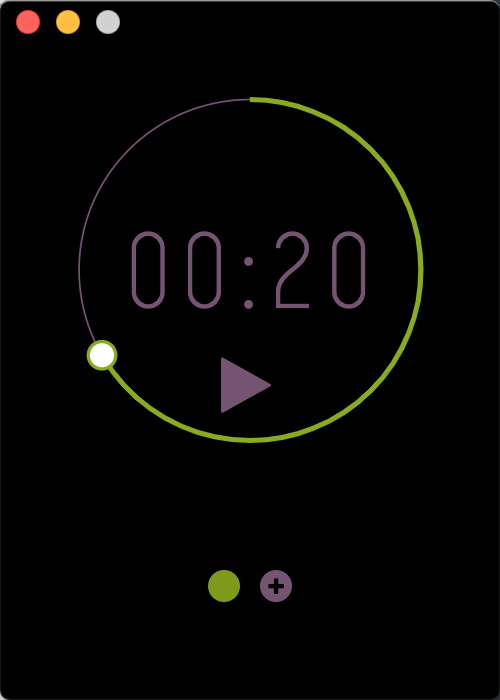

# Simple Pomodoro

Simple Pomodoro is a minimal pomodoro without all the bells and whistles

Check https://en.wikipedia.org/wiki/Pomodoro_Technique for more details.

## Screenshots

  
  

## Technical
Simple Pomodoro is built with vanilla JS, CSS, HTML, and Electron

## License

MIT &copy [Chinedum Ukejianya](https://github.com/cukejianya)
